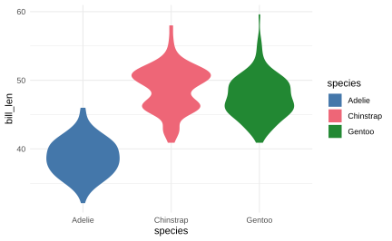
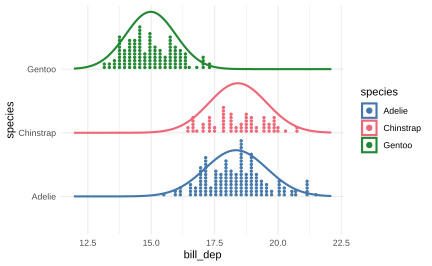

```{r}
library(tidyverse)
library(ggdist)
library(distributional)
library(tinytable)
library(khroma)
theme_set(theme_minimal())
```

# Working with `{ggdist}`

## Dotplots

The `{ggdist}` package has a lot of very useful layers for ggplot for the visualization of data distributions.
Let's start by experimenting with the `penguins` data set that's built into R.
You can find documentation for the data by running

```{r}
#| eval: false

?penguins
```

```{r}
penguins |> 
  count(species) |> 
  ## tt() generates a nice table
  ## that will have the same formatting 
  ## in every output format
  tt()
```

Here's the a dot plot of `bill_len` across the whole data set.
(The warning that missing values were excluded is fine)

```{r}
penguins |> 
  ggplot(
    aes(x = bill_len)
  ) +
  geom_dots(
    fill = "#4477AA",
    color = "black"
  )
```

::: callout-important
## To Do

- What happens if you modify the plotting code above to map `species` to the `y` aesthetic?

- What happens if you modify the plotting code above to map `species` to `x` and `bill_len` to `y`?
:::

::: callout-note
## Bonus

The y-axis this plot isn't really meaningful.
The height of the stack of dots represents the number of data points in the stack.
The y-axis values ranging from 0 to 1 are really just for internal use by the `geom_dots()` layer.

- Dig through [the ggplot2 documentation on themes](https://ggplot2.tidyverse.org/reference/index.html#themes) to figure out how to get rid of the labels and ticks along the y-axis

```{r}
penguins |> 
  ggplot(
    aes(x = bill_len)
  ) +
  geom_dots(
    fill = "#4477AA",
    color = "black"
  ) 
```
:::

## Slabs

A [probability density function](https://lin611-2026.github.io/materials/notes/2026-09-22_thinking-prob/#continuous-cases) describes a curve, and the probability that a data point appears within a certain range equals the area under that curve.
The abstract distributions (e.g. normal, beta) are mathematically defined.
A *kernel density function* tries to estimate a probability density function based on your data.
We can plot one for `penguins$bill_len`.

```{r}
penguins |> 
  ggplot(
    aes(x = bill_len)
  ) +
  stat_slab(
    fill = "#4477AA"
  )
```

::: callout-important
## To Do

- Just like the `geom_dots()`, experiment with the mappings

  - `aes(x = bill_len, y = species)` and `aes(x = species, y = bill_len)`

- A "violin plot" is just a kernel density estimate plotted symmetrically to each **side** (👈👀).
  I made the plot below using `stat_slab()`.
  Browse through the [`stat_slab()` documentation](https://mjskay.github.io/ggdist/reference/stat_slab.html) and try to recreate this plot.

{fig-align="center"}
:::

# Working with `{distributional}`

The `{distributional}` lets you define probability distributions, and then do things with them.

```{r}
basic_norm <- dist_normal(
  mu = 0, sigma = 1
)
```

```{r}
# generate 20 random values
generate(basic_norm, 20)
```

```{r}
# get the range of values that 
# 95% of the probability mass 
# lies between
hilo(
  basic_norm,
  size = c(95)
)
```

Combining `{distributional}` and `{ggdist}` can be really handy.

```{r}
ggplot() +
  stat_slab(
    aes(xdist = basic_norm),
    fill = "#4477AA"
  )
```

You can also have `{distributional}` objects in a data frame

```{r}
penguins |> 
  summarise(
    mean = mean(bill_dep, na.rm = T),
    sd = sd(bill_dep, na.rm = T)
  ) |> 
  mutate(
    dist = dist_normal(mean = mean, sd = sd)
  ) ->
  bill_dep_dist

bill_dep_dist |> 
  tt()
```

::: callout-important
## To Do

- Using the data frame `bill_dep_dist`, plot the normal approximation of the `bill_dep` data.

- If you adjust the `summarise()` function to group `.by = species`, what happens?

- What happens if you map `xdist = dist` and `y = species`?
:::

::: callout-tip
## Bonus

The plot below combines the data dot plot, as well as the normal approximation for each data series.
Try to recreate it.

{fig-align="center"}
:::
